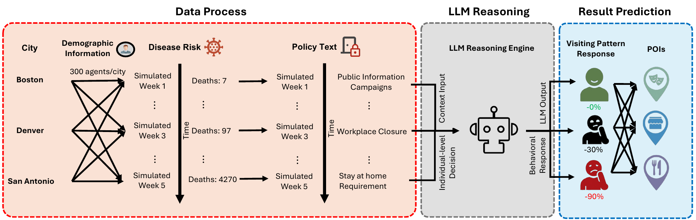

# Simulating Population Compliance with Pandemic Interventions Using Large Language Models



*Figure 1. End-to-end pipeline.*

---

## Overview

This project simulates how individual residents across three U.S. cities — **Boston (MA)**, **Denver (CO)**, and **San Antonio (TX)** — respond to pandemic policy interventions (e.g., public information campaigns, workplace closures, stay-at-home orders) during the early COVID-19 period (March–April 2020). Each city is represented by a synthetic population of 300 demographically representative agents. Every agent independently receives a context-rich prompt and uses an LLM as a reasoning engine to predict their own visitation behavior change across three place-of-interest (POI) categories. Predicted distributions are then compared against ground-truth mobility data from Advan Research.

---

## Repository Structure

```
Policy-Agent/
├── config.json
├── structure.png
│
├── code/
│   ├── simulate.py
│   ├── calculate_results.py
│   ├── utils.py
│   └── models.py
│
├── prompts/
│   ├── advanced_prompt_num_nocbg_allpoi.txt
│   ├── LLM+IPF_phase1.txt
│   └── LLM+IPF_phase2.txt
│
├── data/
│   ├── pandemic_data/
│   └── policy_data/
│       ├── Massachusetts/
│       ├── Colorado/
│       └── Texas/
│
├── credentials/
│   ├── openai_api_key.json
│   ├── gemini_api_key.json
│   └── grok_api_key.json
│
└── results/
    ├── boston/
    │   ├── llm_ipf_agents.jsonl
    │   ├── GPT-4.1/
    │   │   ├── llm_ipf_agents_result_GPT-4.1_modified_n300.jsonl
    │   │   ├── all_pois_city_comparison_box.png
    │   │   └── {poi}_city_metrics.csv
    │   ├── Gemini-2.5-Pro/
    │   ├── Grok-4.1-Fast-Reasoning/
    │   └── GPT-4.1+Gemini-2.5-Pro+Grok-4.1-Fast-Reasoning/
    ├── denver/  (same structure)
    └── san_antonio/  (same structure)
```

---

## Config

### Configuration — `config.json`

All simulation parameters are centralized in `config.json` at the repository root. Key sections:

| Section | Key parameters |
|---|---|
| `simulation` | `num_agents` (300), `random_seed`, `dropout_rate` (0.3), `simulation_dates`, `baseline_dates`, `news_cutoff` |
| `cities` | Name, display name, state abbreviation, total population, FIPS prefix, city description |
| `models` | `simulation_models`, `evaluation_models`, per-model API config (type, model name, temperature, max tokens) |
| `poi` | Canonical → display name mapping; canonical → CSV column name mapping |
| `evaluation` | Y-axis limits for city plots, per-city overrides, file read retry settings |

---

## Running the Pipeline

### Requirements

```bash
pip install pandas numpy scipy matplotlib openai google-generativeai
```

### Step 1 — Generate agents and run the simulation

```bash
cd Policy-Agent/code
python simulate.py
```

### Step 2 — Evaluate and visualize results

```bash
python calculate_results.py
```

---

## Output Format

### Simulation Results — `results/{city}/{model}/llm_ipf_agents_result_{model}_modified_n300.jsonl`

One JSON record per line. Each record corresponds to one agent's response on one simulation date:

```json
{
  "agent_id": 0,
  "simulation_date": "2020-03-16",
  "gender": "Female",
  "age": "30-39 years",
  "race": "White",
  "education": "Master's Degree",
  "household_income": "Medium Income",
  "occupation": "High-Skill Professional & Technical",
  "reasoning": {
    "Restaurants_and_Bars_reasoning": "...",
    "Retail_reasoning": "...",
    "Arts_and_Entertainment_reasoning": "..."
  },
  "predicted_changes": {
    "Restaurants_and_Bars": -0.45,
    "Retail": -0.20,
    "Arts_and_Entertainment": -0.75
  }
}
```

`predicted_changes` values are fractional (e.g., `-0.45` = 45% reduction in visits relative to baseline). The `reasoning` field contains the agent's step-by-step chain-of-thought for each POI category.

### Evaluation Metrics — `results/{city}/{model}/{poi}_city_metrics.csv`

One row per simulation date:

| Column | Description |
|---|---|
| `date` | Simulation week (YYYY-MM-DD) |
| `js_divergence` | Jensen-Shannon divergence between predicted and ground-truth visit-change distributions |
| `median_diff` | Median predicted change minus median ground-truth change |

---

## Data Availability

The POI-related data used in this study are not publicly available but can be requested from Dewey ([https://www.deweydata.io/](https://www.deweydata.io/)). All other data have been sourced from publicly available channels. The `data/` folder contains processed versions of these data sources that are ready for direct use in the simulation.

---

## Citation

If you use this code or data, please cite accordingly.
