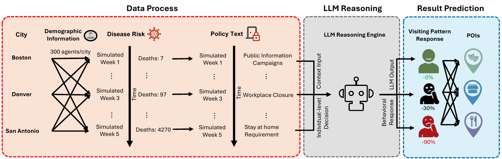

# Simulating Population Compliance with Pandemic Interventions Using Large Language Models



*Figure 1. End-to-end pipeline.*

---

## Overview

This project simulates how individual residents across three U.S. cities — **Boston (MA)**, **Denver (CO)**, and **San Antonio (TX)** — respond to pandemic policy interventions (e.g., public information campaigns, workplace closures, stay-at-home orders) during the early COVID-19 period (March–April 2020). Each city is represented by a synthetic population of 300 demographically representative agents. Every agent independently receives a context-rich prompt and uses an LLM as a reasoning engine to predict their own visitation behavior change across three place-of-interest (POI) categories. Predicted distributions are then compared against ground-truth mobility data from Advan Research.

Four simulation designs share this data, this config and this agent pool, one script each:

| Design | Script | LLM calls per city | What it produces |
|---|---|---|---|
| **1-step (main)** | `code/simulate.py` | 1 per agent × date (1,500) | Per-agent visitation change |
| **2-step** | `code/simulate_two_stage.py` | 2 per agent × date (3,000) | A 1–5 policy-compliance score, then the visitation change conditioned on it |
| **Neutral prompt** | `code/simulate_neutral.py` | 1 per agent × date (1,500) | The same as the 1-step run, from a prompt stripped of every framing cue — the sensitivity arm |
| **City-level median** | `code/simulate_city_level.py` | 1 per date (5) | The city's visitation-change distribution as five box-plot statistics, median included, with no agents at all |

---

## Repository Structure

```
Policy-Agent/
├── config.json
├── structure.png
│
├── code/
│   ├── simulate.py                 # 1-step simulation (main pipeline)
│   ├── simulate_two_stage.py       # 2-step: compliance score → visitation
│   ├── simulate_neutral.py         # neutral-prompt sensitivity arm
│   ├── simulate_city_level.py      # direct city-level distribution / median
│   ├── calculate_results.py
│   ├── utils.py
│   └── models.py
│
├── prompts/
│   ├── llm_ipf_phase1.txt                     # agent generation, phase 1
│   ├── llm_ipf_phase2.txt                     # agent generation, phase 2
│   ├── agent_one_stage.txt                    # 1-step
│   ├── agent_one_stage_neutral.txt            # neutral arm
│   ├── agent_two_stage_phase1_compliance.txt  # 2-step, stage 1
│   ├── agent_two_stage_phase2_visitation.txt  # 2-step, stage 2
│   └── city_level_distribution.txt            # city-level arm
│
├── data/
│   ├── pandemic_data/
│   └── policy_data/
│       ├── Massachusetts/
│       ├── Colorado/
│       └── Texas/
│
├── credentials/
│   ├── openai_api_key.json
│   ├── gemini_api_key.json
│   └── grok_api_key.json
│
└── results/
    ├── boston/
    │   ├── llm_ipf_agents.jsonl
    │   ├── GPT-4.1/
    │   │   ├── llm_ipf_agents_result_GPT-4.1_onestage_n300.jsonl   # 1-step
    │   │   └── all_pois_city_comparison_box_one_stage.png
    │   ├── Gemini-2.5-Pro/
    │   ├── Grok-4.1-Fast-Reasoning/
    │   └── GPT-4.1+Gemini-2.5-Pro+Grok-4.1-Fast-Reasoning/
    ├── denver/  (same structure)
    ├── san_antonio/
    │   └── {model}/  (as above, plus the variant runs)
    │       ├── llm_ipf_agents_result_{model}_twostage_n300.jsonl   # 2-step
    │       ├── llm_ipf_agents_result_{model}_neutral_n300.jsonl    # neutral prompt
    │       └── all_pois_city_comparison_box_two_stage.png
    └── city_level_simulation/
        └── san_antonio/{model}/
            ├── city_level_boxstats_{model}.jsonl
            └── city_level_boxstats_{model}.csv
```

---

Prompt files are named `{pipeline}_{stage_or_variant}.txt`, all lowercase: the
`llm_ipf_*` pair builds the agent pool, the `agent_*` group holds the per-agent
simulation prompts (one-stage, its neutral variant, and the two stages of the
2-step run), and `city_level_*` holds the agent-free city-level prompt.

---

## Config

### Configuration — `config.json`

All simulation parameters are centralized in `config.json` at the repository root. Key sections:

| Section | Key parameters |
|---|---|
| `simulation` | `num_agents` (300), `random_seed`, `dropout_rate` (0.3), `simulation_dates`, `baseline_dates`, `news_cutoff` |
| `cities` | Name, display name, state abbreviation, total population, FIPS prefix, city description |
| `models` | `simulation_models`, `evaluation_models`, per-model API config (type, model name, temperature, max tokens) |
| `poi` | Canonical → display name mapping; canonical → CSV column name mapping |
| `evaluation` | `plot_poi_types` (the three POIs the box plot lays out), y-axis limits for city plots, per-city overrides, file read retry settings |
| `city_level` | Parameters for the direct city-level distribution experiment (`code/simulate_city_level.py`): `cities`, `models`, `repeats`, `dropout_rate`, `max_tokens_override`, retry settings, `demographics`, output filename templates, `ylim` |

Two optional keys in `simulation` name the output files of the variant runs; both
have the defaults shown, so neither has to be set:

| Key | Default |
|---|---|
| `agent_file_template_two_stage` | `llm_ipf_agents_result_{model}_twostage_n{n}.jsonl` |
| `agent_file_template_neutral`   | `llm_ipf_agents_result_{model}_neutral_n{n}.jsonl` |

---

## Running the Pipeline

### Requirements

```bash
pip install pandas numpy scipy matplotlib openai google-generativeai
cd Policy-Agent/code
```

Every script reads its defaults from `config.json`, so a bare invocation is a
complete run. Flags below override those defaults for one run only.

### `simulate.py` — 1-step simulation

No flags: cities, models, dates, agent count, dropout rate and output filename
all come from `config.json` (`simulation`, `cities`, `models.simulation_models`).

```bash
python simulate.py
```

### `simulate_two_stage.py` — 2-step simulation

| Flag | Default | Effect |
|---|---|---|
| `--cities` | `san_antonio` | City names to run; `all` for every city in `config.cities` |
| `--models` | `config.models.simulation_models` | Model names to run |
| `--agent-source` | `result-file` | `result-file` reuses the agents in each model's 1-step results (pairs record for record with them); `pool-file` uses `results/{city}/llm_ipf_agents.jsonl`, a different agent set |
| `--reference-model` | *(none)* | With `result-file`: take every model's agents from this one model's results, so all models run on one common set |
| `--regenerate-agents` | off | With `pool-file`: re-run LLM+IPF instead of reusing the pool file |
| `--gemini-auth` | `adc` | `adc` = Vertex AI Application Default Credentials; `api-key` = `credentials/gemini_api_key.json`. GPT and Grok always use the key files |
| `--print-prompt` | off | Print both stage prompts for the first agent × date and exit, calling no model |

```bash
python simulate_two_stage.py --cities all --models GPT-4.1 --gemini-auth api-key
```

Writes `results/{city}/{model}/llm_ipf_agents_result_{model}_twostage_n{N}.jsonl`.

### `simulate_neutral.py` — neutral-prompt simulation

| Flag | Default | Effect |
|---|---|---|
| `--cities` | `san_antonio` | City names to run; `all` for every city in `config.cities` |
| `--models` | `config.models.simulation_models` | Model names to run |
| `--dates` | `config.simulation.simulation_dates` | Simulation dates to run |
| `--agent-source` | `result-file` | As for the 2-step script: re-run the exact 1-step cohort, or use the pool file |
| `--dropout-rate` | `0.3` | Fraction of context items dropped per agent × date |
| `--overwrite` | off | Truncate the output file instead of resuming into it |
| `--allow-prompt-mismatch` | off | Append even when the existing file was written from another version of the template |
| `--skip-prompt-checks` | off | Do not abort when the template still carries a framing cue the neutral arm removes |
| `--print-prompt` | off | Print the first assembled prompt and exit, calling no model |

Resuming is the default: completed (agent, date) pairs are read back from the
output file and skipped, so an interrupted run restarts where it stopped.

```bash
python simulate_neutral.py --models GPT-4.1 --dates 2020-03-16 2020-03-23
```

Writes `results/{city}/{model}/llm_ipf_agents_result_{model}_neutral_n{N}.jsonl`.

### `simulate_city_level.py` — city-level median simulation

| Flag | Default | Effect |
|---|---|---|
| `--cities` | `config.city_level.cities` | City names to run; `all` for every city in `config.cities` |
| `--models` | `config.city_level.models` | Model names to run |
| `--dates` | `config.simulation.simulation_dates` | Simulation dates to run |
| `--repeats` | `1` | LLM calls per model × date; raise it to average the five statistics over independent runs |
| `--dropout-rate` | `0.0` | Fraction of context items dropped; 0 gives the single call the complete context |
| `--max-tokens` | `8192` | Response token ceiling, overriding the registry value |
| `--demographics` | `full` | `full` / `brief` (no age breakdown) / `none` (city introduction and population alone — needs no CBG data file) |
| `--city-data-dir` | `data/city_data/` | Directory holding `{city}/cbg_detail_info.csv` for the composition block |
| `--print-prompt` | off | Print the first assembled prompt and exit, calling no model |

```bash
python simulate_city_level.py --cities all --repeats 5 --demographics none
```

Writes `results/city_level_simulation/{city}/{model}/city_level_boxstats_{model}.jsonl`
and the tidy `.csv` beside it.

### `calculate_results.py` — evaluation and box plots

| Flag | Default | Effect |
|---|---|---|
| `--pipeline` | `one_stage` | Which run to evaluate: `one_stage` / `two_stage` / `neutral`. Names both the input file and every output file |
| `--cities` | every city in `config.cities` | City names to evaluate |
| `--models` | `config.models.evaluation_models` | Model specs; a `+`-joined spec (e.g. `GPT-4.1+Gemini-2.5-Pro+Grok-4.1-Fast-Reasoning`) pools those models' predictions into one distribution |
| `--data-dir` | `data/city_data/` | Directory holding `{city}/{city}_patterns_updated.csv`, the ground truth |
| `--gt-cbg-prefix` | each city's `cbg_prefix` | Restrict the ground truth to CBGs under this prefix; the config value is the 5-digit county FIPS |
| `--plots-only` | off | Write only the box plot, not the per-POI metrics CSVs |

```bash
python calculate_results.py --pipeline two_stage --cities san_antonio --plots-only
```

Writes `all_pois_city_comparison_box_{pipeline}.png` and
`{poi}_city_metrics_{pipeline}.csv` into `results/{city}/{model_spec}/`.

---

## Output Format

### Simulation Results — `results/{city}/{model}/llm_ipf_agents_result_{model}_onestage_n300.jsonl`

One JSON record per line. Each record corresponds to one agent's response on one simulation date:

```json
{
  "agent_id": 0,
  "simulation_date": "2020-03-16",
  "gender": "Female",
  "age": "30-39 years",
  "race": "White",
  "education": "Master's Degree",
  "household_income": "Medium Income",
  "occupation": "High-Skill Professional & Technical",
  "reasoning": {
    "Restaurants_and_Bars_reasoning": "...",
    "Retail_reasoning": "...",
    "Arts_and_Entertainment_reasoning": "..."
  },
  "predicted_changes": {
    "Restaurants_and_Bars": -0.45,
    "Retail": -0.20,
    "Arts_and_Entertainment": -0.75
  }
}
```

`predicted_changes` values are fractional (e.g., `-0.45` = 45% reduction in visits relative to baseline). The `reasoning` field contains the agent's step-by-step chain-of-thought for each POI category.

### Evaluation Metrics — `results/{city}/{model}/{poi}_city_metrics_{pipeline}.csv`

One row per simulation date:

| Column | Description |
|---|---|
| `date` | Simulation week (YYYY-MM-DD) |
| `js_divergence` | Jensen-Shannon divergence between predicted and ground-truth visit-change distributions |
| `median_diff` | Median predicted change minus median ground-truth change |

---

## Data Availability

The POI-related data used in this study are not publicly available but can be requested from Dewey ([https://www.deweydata.io/](https://www.deweydata.io/)). All other data have been sourced from publicly available channels. The `data/` folder contains processed versions of these data sources that are ready for direct use in the simulation. The one file it cannot carry is `data/city_data/{city}/cbg_detail_info.csv`, the CBG demographic table derived from the POI data: `simulate.py` needs it to generate an agent pool (the pools it produced are shipped under `results/{city}/llm_ipf_agents.jsonl`, so the variant runs need no regeneration), and `simulate_city_level.py` needs it for the city-composition block (or run that one with `--demographics none`).

---

## Citation

If you use this code or data, please cite accordingly.
